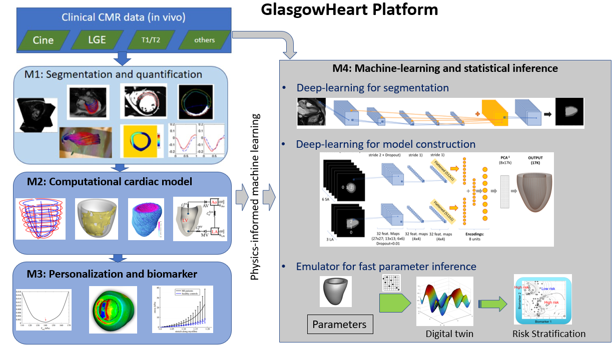

# GlasgowHeart
GlasgowHeart platform for personalized modelling of human heart. It is organized into 4 modules, and each can be run separately. Currently matlab is the main programming language, and using scripts for run, this will require certain knowledge of Matlab. In the future, we would like to develop a GUI package for easy use.  

The four modules are: 1) image processing, 2) biomechanics modelling, 3) personalization, and parameter inference of left ventricular (LV) mechanics and 4) statistical emulation as shown in the Figure. Modules 1, 2 and 3 have been developed in MATLAB by the co-authors, and module 4 is programmed in Python using Tensor Flow, Scikit-learn, XGBoost to use advanced machine-learning methods. For computational modelling in module 2, we further use LibMesh, IBAMR, Fenics for solving non-linear systems, Visit and Paraview for 3D visualization. Module 2 can also work with other commercial packages for biomechanics simulations (ABAQUS, FEAP). 

In detail 
* M1: importing anonymised cardiac DICOM images into MATLAB; manually segmenting LV wall boundaries in the 3D scanner coordinate system; quantification of myocardial infarction (MI) from late gadolinium enhancement imaging, T1/T2 mapping; Diffusion Tensor-MRI dataset integration; circumferential and radial strain estimation from cine images using deformable registration;

* M2: aligning LV wall boundaries from short-axis and long-axis cine images; mapping MI region into the 3D LV geometry for data fusion; myofibre generation and close-loop biomechanical LV model construction which can be simulated using both commercial software and open-source packages;

* M3: LV models are calibrated by matching the model predictions to in vivo measurements (cavity volume and strains); Potential biomarkers, such as local stress/strain, myocardial stiffness and contractility can be summarized for each patient; A multi-step gradient-based inference and Bayesian inference are available for personalizing the LV biomechanical model;

*M4: A deep-learning based automatic pipeline for predicting the LV geometry directly from cine images, which further consists of two neural networks, one for segmentation and the other one for LV geometry; machine-learning based emulators for fast parameter inference, i.e. Gaussian process, XGBoost, etc. 

# Developers 
The Heart Team from the SofTMech Centre funded by UKEPSRC, School of Mathematics and Statistics, University of Glasgow. 

