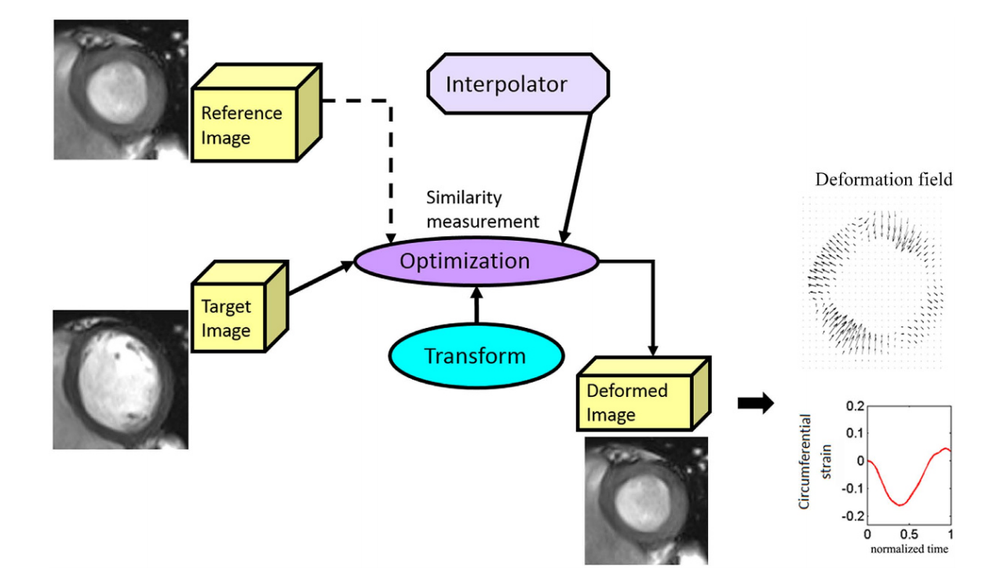

# GlasgowHeart:  deformation tracking for strain estimation

## How to run

* run GLASGOWHEARTcine

* from project menu, load the data configure figure, see example in test_ex

* from the drop list choose the series for strain estimation

* if it is an apical slice, check it, otherwise uncheck 

* crop the image to make sure the LV in the centre. The cropped image should be bigger than LV, but no more than twice of the LV for reducing the computational time 

* segment the LV wall, first endocaridal boundary, then epicardial boundary. Left click to start a new curve, right click to end the curve

* Define AHA regions, depeonding on whether it is apical region, 6 regions will be manually defined, starting from the RV insertion points near inferior, the first will be inferiro septum, followed by antieror septum

* save the preprocessing to a bach file, so it can be run later 

* load the back file and run it. 

## References

* Gao, Hao, et al. "Left ventricular strain and its pattern estimated from cine CMR and validation with DENSE." Physics in Medicine & Biology 59.13 (2014): 3637.

* Mangion, K., Gao, H., McComb, C., Carrick, D., Clerfond, G., Zhong, X., Luo, X., Haig, C.E., Berry, C., 2016. A Novel Method for Estimating Myocardial Strain: Assessment of Deformation Tracking Against Reference Magnetic Resonance Methods in Healthy Volunteers. Sci Rep 6, 38774. https://doi.org/10.1038/srep38774
