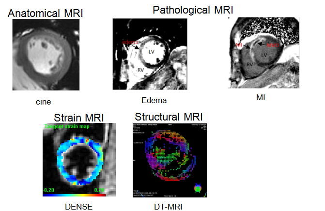
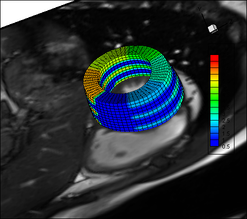

# Segmentation and Geometry reconstruction

## Manual segmentation

## Mesh generation with AHA17 division

## How to run 
* create a folder for the subject to be segmented. For example ./Results/HV01, this will be assigned to resultDirRoot in the configure file, LVWM_config_HV01_EarlyDia.m. 
	  
* create a folder to save results for the reconstructed geometry at specific cardaic phase within the new folder from the previous step, i.e. early_diastole, it will be assinged to resultDir varialbe in LVWM_config_HV01_EarlyDia.m

* set up the configure file which will be needed to specify the MR image folder to the varialbe: dicomDir. You will need to go through each line of the configure file to specify a different subject.  A example configure file can be found in the result file
    Key variables: TimeEarlyOfDiastole, TimeEndOfSystole, SASlicePositionApex, timeInstanceSelected, and dirMidSA(seriesIndex,1).ImgDir which requires all cine images of one image plane needs to be outputed into one folder and specify the name to ImgDir. Both short and long axis cine images need to be explicitly specified for loading all images into Matlab. 
	 
Update the config file?
	 * Line 6: dicomDir = ‘the root directory of the MR images’
         * Line 7: resultDirRoot = ‘…/some_folder/Results’
         * Line 8: resultDir = ‘HVex/earlyDiastole’
	 * Lines 13 to 16 are the settings for mac, you can leave it if you are using windows. You will only need to update lines 6-7 or lines 13-16 depending on your system
     	 * Line 42: change the name to be ‘HVex’
     	 * Line 43: the time instance at end of systole, before the aortic valve closing, numbers can be found from the dicom viewer
         * Line 44: usually will be 1
         * Line 45: the time instance at early of diastole, after the aortic valve closed, and the mitral valve just opens, usually two or 3 larger than the time instance of end-systole
         * Line 50: the long-axis positions, usually 3
         * Line 51: the number of images for one cardiac cycle, can be found in the dicom viewer
         * Lines 80-83 are for one short-axis image planes, you will only need to update the line 81, the ImgDir, which is the folder within dicomDir. 
         * The following codes of each block are the repetition for each short axis slices, you may need to add or comment out some blocks depending on how many short-axis slices you have
         * Then the last three blocks for the three long axis images, update correspondingly.

* LVWM_DicomSampleSelection
   This will load all related images into matlab, i.e. all short axis and long axis cine images. A file selection window will appear, choose the config file just prepared.
   
* Function_LVWM_SASegManualUsingImpoint
 Segment short axis images for the left ventricular wall. Detailed steps are listed as Matlab Message. The procedure is the same as LVWM_DicomSampleSelection
        * Select the config file
	* a list dialogue will appear, it starts from 1, and whenever you finish one image, it moves into next. By choosing different number, you can segment different images. Segmentation for each image will be saved after you finish each one, that means you do not need to redo those segmentations you have done 	* 	  * Drag a rectangular shape to cover the whole LV, right click and select “crop image”.
	* Click ok to segment, Cancle to quit the segmentation procedure. You can also use cmd+c (mac) or ctr+c (window) when you are in the segmentation procedure. Note: when the list dialogue appears, you need to click cancel to quite the segmentation
	* A new window will show the cropped image, and maximize the window, in the left side, there are two buttons, ‘stop’ and ‘re-plot’. Put a point in the endocardial boundary either clockwise or anticlockwise way, you do not need to put too many points, around 10 will be enough. Before putting the last points, click ‘stop’ button, then put the last point. Now click ‘replot’, a fitted curve will be plotted. If you are happy with the boundary, then double press ‘space’ key in the keyboard, remember make sure the window with segmented boundary is in focus (you can click the window). If you are not happy with the boundary, you can click a point, and hold ‘left mouse key’ to move that point, and then click ‘replot’. Similarily, double press ‘space’ key to finish the endocardial boundary segmentation
	* A new window with segmented endocardial boundary will show. In a similar way, you can define the epicardial boundary 
	* In the end of each segmentation of each image, the boundaries will be plotted in 3D with images together, it may be slow. 

 
 * Segment long-axis images
	* Run All_LA_ManualSegmentation.m, similar as the short-axis segmentation
	* Run LVWM_Apex_LASegManual to segment the apical point 
	
* Motion correction (SAAdjustmentBYLASeries.m)
        * a gui interface will appear, you will need to run this code three times, each time you choose different long-axis views, from 1 to 3. 
    	* First choose the config file, 
    	* enter the long-axis view, from 1 to 3
	* enter the short-axis image number to be corrected, suggested you start from 1, and press ‘entre’
	* click DisplayImage button, you will need to move the image windows to make sure they are not overlapped. In Figure 2 window, it shows the image in 3D, and the endocardial boundary for the selected short-axis slice
	* now you can click ‘move+’ or ‘move-’ to move the endocardial boundary, you will need to try to match the endocardial boundary with the corresponding boundary from the long-axis view, or try to move the boundary in the middle of the ventricle	
	* then enter another short-axis image number, ie 2, and press ‘enter’. 
	* click DisplayImage button. The window with 3D image may not update the endocardial boundary, please click ‘move +’ or ‘move -’, it will show the new endocardial boundary. 
	* Repeat until the last short-axis image, and click ‘show all together 3D LA’, you can check how they look like. 
	* Finally click ‘SAVE’, the corrected boundaries will be saved
	* Repeat for other long-axis views. After this step, the motion artefacts during MRI scan will be minimized

* Run LVWM_SALASeg_LongAxisAlignment (choosing the config file for the current subject).

* Run LVWM_SA_GuidPointsGeneration_LongAxisAlignment (choosing the config file for the current subject).

* Run LV_EndoFitting, then LV_EpiFitting, then LV_WholeMesh for mechanics mesh generation

 
  
